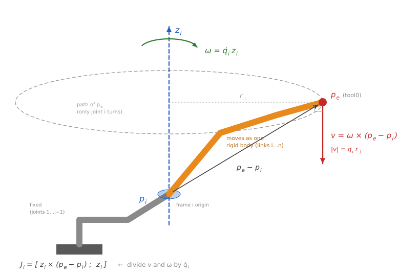

# robot_kinematics : DH, FK, Jacobian, IK<!-- omit from toc -->

이 문서는 관절각과 tool0 pose를 잇는 4가지 계산을 다루며, 각 절은 **문제 → 유도 → 코드 대응 → 함정 → 검증** 순서로 구성됨.

- [0. 전체 구성](#0-전체-구성)
- [1. DH 파라미터 (`dh.py`)](#1-dh-파라미터-dhpy)
  - [1.1 링크 표현에 필요한 파라미터 수](#11-링크-표현에-필요한-파라미터-수)
  - [1.2 링크 변환 행렬 유도](#12-링크-변환-행렬-유도)
  - [1.3 코드: dh_transform](#13-코드-dh_transform)
  - [1.4 UR10e 테이블 읽기](#14-ur10e-테이블-읽기)
  - [1.5 DH 규약의 주의점](#15-dh-규약의-주의점)
  - [1.6 검증: 기본 변환](#16-검증-기본-변환)
- [2. FK (`fk.py`)](#2-fk-fkpy)
  - [2.1 관절각에서 pose로](#21-관절각에서-pose로)
  - [2.2 누적곱](#22-누적곱)
  - [2.3 코드: fk_frames](#23-코드-fk_frames)
  - [2.4 중간 프레임을 전부 반환하는 이유](#24-중간-프레임을-전부-반환하는-이유)
  - [2.5 영점 자세 위치 유도](#25-영점-자세-위치-유도)
  - [2.6 검증: 서로 독립인 두 기준](#26-검증-서로-독립인-두-기준)
- [3. Jacobian (`jacobian.py`)](#3-jacobian-jacobianpy)
  - [3.1 관절 속도에서 pose 속도로](#31-관절-속도에서-pose-속도로)
  - [3.2 열 공식 유도](#32-열-공식-유도)
  - [3.3 코드: jacobian](#33-코드-jacobian)
  - [3.4 인덱스와 행 순서 규약](#34-인덱스와-행-순서-규약)
  - [3.5 특이점](#35-특이점)
  - [3.6 검증: 수치미분 대조](#36-검증-수치미분-대조)
- [4. IK (`ik.py`)](#4-ik-ikpy)
  - [4.1 Pose에서 관절각으로](#41-pose에서-관절각으로)
  - [4.2 Pose 오차의 6차원 벡터 표현](#42-pose-오차의-6차원-벡터-표현)
  - [4.3 뉴턴법에서 DLS로 확장](#43-뉴턴법에서-dls로-확장)
  - [4.4 DLS와 특이점](#44-dls와-특이점)
  - [4.5 코드: solve_ik](#45-코드-solve_ik)
  - [4.6 IK 사용 시 주의점](#46-ik-사용-시-주의점)
  - [4.7 검증: FK와 IK 왕복, 실패 보고](#47-검증-fk와-ik-왕복-실패-보고)
- [참고 문헌](#참고-문헌)

---

## 0. 전체 구성

아래 4개의 모듈은 순서대로 앞 단계를 쌓아 올리는 구조임.

```
dh.py         DH 한 행 (a, d, α) + 관절각 θ  →  4x4 링크 변환
   │
   ▼
fk.py         링크 변환 누적곱  →  base_link ~ tool0 pose
   │
   ▼
jacobian.py   FK 중간 프레임 재사용  →  q̇ → twist (6xN)
   │
   ▼
ik.py         Jacobian 반복 선형화  →  목표 pose → 관절각
```

문서 전체에서 쓰는 공통 기호는 다음과 같음.

| 기호                 | 의미                                     |
| -------------------- | ---------------------------------------- |
| $q \in \mathbb{R}^6$ | 관절각 벡터 [rad]                        |
| $T \in SE(3)$        | 4×4 동차변환 (pose = 위치 + 방향)        |
| $R \in SO(3)$        | 3×3 회전행렬                             |
| $p_e$                | end-effector(tool0) 위치                 |
| $z_i,\ p_i$          | 프레임 $i$의 z축 방향과 원점 (base 기준) |
| $J$                  | 기하학적 Jacobian (6×6)                  |
| $e$                  | 목표와 현재 pose의 6D 오차               |

---

## 1. DH 파라미터 (`dh.py`)

### 1.1 링크 표현에 필요한 파라미터 수

두 프레임 사이 강체 변환의 자유도는 6개(위치 3 + 방향 3)이지만, 로봇 링크를 이어 붙일 때 6개를 다 쓸 필요는 없음.

Denavit–Hartenberg 규약은 **프레임 배치에 제약을 걸어** 자유도를 4개로 줄이는 방식으로 규칙은 아래와 같음.

1. 프레임 $i$의 $z_i$ 축 = **관절 $i{+}1$의 회전축**
2. 프레임 $i$의 $x_i$ 축 = $z_{i-1}$과 $z_i$의 **common normal(공통수직선)** 방향

여기서 핵심은 2번 규칙으로, $x_i \perp z_{i-1}$이 강제되므로 프레임 $i{-}1 \to i$ 변환에 y축 이동이나 y축 회전이 등장할 수 없기 때문임.  
결국 남는 것은 z축과 x축 각각의 회전과 이동뿐이며, 이 4개가 아래 표의 파라미터에 대응함.

| 파라미터   | 축  | 의미                                    |
| ---------- | --- | --------------------------------------- |
| $\theta_i$ | z   | 관절 회전각 (revolute joint의 **변수**) |
| $d_i$      | z   | 링크 offset (축을 따라 떨어진 거리)     |
| $a_i$      | x   | 링크 길이 (common normal의 길이)        |
| $\alpha_i$ | x   | 링크 twist (인접 두 축이 이루는 각)     |

요점은 "6개 필요한데 4개로 줄였다"가 아니라 **프레임을 규칙대로 놓으면 4개로 충분해진다**는 것이며, 그 대가는 프레임 위치를 자유롭게 고를 수 없다는 제약임.

### 1.2 링크 변환 행렬 유도

standard(classic) DH의 프레임 $i{-}1 \to i$ 변환은 기본 변환 4개의 곱으로 이루어짐.

$$
{}^{i-1}T_i = R_z(\theta_i)\, T_z(d_i)\, T_x(a_i)\, R_x(\alpha_i)
$$

- ${}^{i-1}T_i$ : 프레임 $i{-}1$에서 본 프레임 $i$의 pose(왼쪽 위 첨자가 기준 프레임)
- $R_z(\theta)$, $R_x(\alpha)$ : z축, x축 둘레의 회전
- $T_z(d)$, $T_x(a)$ : z축, x축 방향의 이동

앞의 두 항은 z축, 뒤의 두 항은 ($\theta$만큼 회전된) x축에 대한 변환이므로, **z축 변환을 먼저 적용하고 x축 변환을 나중에 적용하는** 순서임.

> $R_z(\theta)$와 $T_z(d)$는 둘 다 같은 z축에 대한 조작이라 **교환 가능**하므로, 문헌에 따라 $T_z(d) R_z(\theta) T_x(a) R_x(\alpha)$로 적기도 하지만 같은 행렬임.  
> 이 성질이 URDF로 변환할 때의 근거가 됨 ([_robot description.md_ 2.1\_분해의 근거: 교환법칙](robot_description.md#21-분해의-근거-교환법칙)).

단계별로 전개하면 아래와 같음.

$$
R_z(\theta) T_z(d) =
\begin{bmatrix} c\theta & -s\theta & 0 & 0 \\ s\theta & c\theta & 0 & 0 \\ 0 & 0 & 1 & d \\ 0&0&0&1 \end{bmatrix}
$$

- $c\theta$, $s\theta$ : $\cos\theta$, $\sin\theta$의 줄임 표기($c\alpha$, $s\alpha$도 같음)

$T_x(a)$를 곱하면 이동 성분이 **현재 회전으로 돌려진 채** 더해지는데, $R \cdot (a, 0, 0)^\top = (a\,c\theta,\ a\,s\theta,\ 0)^\top$ 이므로 아래와 같음.

$$
R_z(\theta) T_z(d) T_x(a) =
\begin{bmatrix} c\theta & -s\theta & 0 & a\,c\theta \\ s\theta & c\theta & 0 & a\,s\theta \\ 0 & 0 & 1 & d \\ 0&0&0&1 \end{bmatrix}
$$

$R_x(\alpha)$는 회전 성분에만 오른쪽 곱으로 붙으므로, $R_z(\theta)R_x(\alpha)$를 계산하면 최종 형태는 아래와 같음.

$$
{}^{i-1}T_i =
\begin{bmatrix}
c\theta & -s\theta\, c\alpha & s\theta\, s\alpha & a\, c\theta \\
s\theta & c\theta\, c\alpha & -c\theta\, s\alpha & a\, s\theta \\
0 & s\alpha & c\alpha & d \\
0 & 0 & 0 & 1
\end{bmatrix}
$$

### 1.3 코드: dh_transform

위 행렬을 그대로 옮긴 것임.

```python
def dh_transform(theta, d, a, alpha):
    """Standard DH link transform: Rz(theta) · Tz(d) · Tx(a) · Rx(alpha)."""
    ct, st = math.cos(theta), math.sin(theta)
    ca, sa = math.cos(alpha), math.sin(alpha)
    return np.array(
        [
            [ct, -st * ca,  st * sa, a * ct],
            [st,  ct * ca, -ct * sa, a * st],
            [0.0, sa,       ca,      d     ],
            [0.0, 0.0,      0.0,     1.0   ],
        ]
    )
```

4번의 행렬 곱 대신 **전개 결과를 상수 시간에 채워 넣는 구조**로, FK가 관절 수만큼 호출하고 IK가 FK를 매 반복 호출하므로 이 한 함수가 전체 성능을 좌우함.

black 재포맷을 막지 않으면 행렬 모양이 무너져 검토가 어려워지기 때문에, 행렬 리터럴은 `# fmt: off` / `# fmt: on`으로 감싸 열 정렬을 유지함.

### 1.4 UR10e 테이블 읽기

```python
# Standard DH rows: (a, d, alpha). theta comes from the joint angle.
UR10E_DH = np.array(
    [
        [0.0,      0.1807,   math.pi / 2],   # joint 1
        [-0.6127,  0.0,      0.0        ],   # joint 2
        [-0.57155, 0.0,      0.0        ],   # joint 3
        [0.0,      0.17415,  math.pi / 2],   # joint 4
        [0.0,      0.11985, -math.pi / 2],   # joint 5
        [0.0,      0.11655,  0.0        ],   # joint 6
    ]
)
```

숫자에서 로봇 형상이 읽힘.

- **joint 2, 3의 $a$가 크고 음수** : upper arm 0.6127 m, forearm 0.5716 m로 UR10e 팔 길이 그 자체이며, $\alpha = 0$ 이라 두 축이 평행해 어깨와 팔꿈치가 한 평면에서 움직임
- **joint 1, 4, 5의 $\alpha = \pm 90°$** : 축이 직각으로 꺾이는 지점이며, joint 4, 5, 6이 한 점 근처에 모여 wrist를 구성함
- **$a$의 음수 부호** : common normal 방향을 어느 쪽으로 잡았느냐의 문제일 뿐 물리적 길이는 절댓값이며, UR 공식 표기를 그대로 따른 것임
- **$\theta$ 열 없음** : revolute joint의 $\theta$는 상수가 아닌 변수라 테이블이 아니라 `q` 인자로 들어옴

### 1.5 DH 규약의 주의점

**standard vs modified** : 두 규약은 프레임을 링크의 어느 쪽 끝에 붙이느냐가 다름.

|                    | 변환 순서                                               | 프레임 $i$의 위치  |
| ------------------ | ------------------------------------------------------- | ------------------ |
| standard (classic) | $R_z(\theta_i) T_z(d_i) T_x(a_i) R_x(\alpha_i)$         | 관절 $i{+}1$ 축 위 |
| modified (Craig)   | $R_x(\alpha_{i-1}) T_x(a_{i-1}) R_z(\theta_i) T_z(d_i)$ | 관절 $i$ 축 위     |

- **규약과 파라미터 값** : 같은 로봇이라도 규약에 따라 파라미터 값이 다르며, 이 프로젝트는 standard를 쓰므로 외부 DH 표를 가져올 때 규약 확인을 빠뜨리면 별도의 오류 없이 틀린 FK가 나옴
- **인자 순서** : 테이블 한 행은 `(a, d, alpha)` 순인데 `dh_transform()` 시그니처는 `(theta, d, a, alpha)`라서 `a`와 `d` 자리가 뒤바뀌며, `fk.py`가 이 교환을 처리함

```python
for i, (theta, (a, d, alpha)) in enumerate(zip(q, dh)):
    frames[i + 1] = frames[i] @ dh_transform(theta, d, a, alpha)
#                                                   ^^^^  테이블 순서와 반대
```

바꿔 넣어도 예외 없이 형태상 이상이 없는 값이 나오기 때문에, 이 실수는 FK-URDF 대조 테스트에서만 드러남.

**xacro와의 동기화** : `dh.py` 값과 `ur10e.urdf.xacro`의 `xacro:property` 값은 **항상 일치해야 하며**, 한쪽만 고치면 계산 결과와 RViz 화면이 어긋남.  
두 값이 어긋나면 테스트가 실패하므로, 일치 여부는 문서가 아니라 테스트로 확인함 ([2.6\_검증: 서로 독립인 두 기준](#26-검증-서로-독립인-두-기준)).

### 1.6 검증: 기본 변환

`test/test_fk.py`의 `TestDHTransform`이 기본 변환 4개의 조립을 최소 케이스로 확인함.

- `test_pure_d_translation` : $\theta=a=\alpha=0$ 이면 순수 z 이동
- `test_pure_a_translation` : 순수 x 이동
- `test_theta_rotates_about_z` : $\theta = 90°,\ a = 1$ 일 때 $(0, 1, 0)$

$a$ 이동이 $\theta$ 회전보다 나중이라 x축 offset이 +y로 돌아가고 순서가 뒤집혔다면 $(1, 0, 0)$이 나오므로, 마지막 케이스가 **곱의 순서**를 잡아내는 역할을 함.

---

## 2. FK (`fk.py`)

### 2.1 관절각에서 pose로

관절각 $q = (\theta_1, \dots, \theta_6)$가 주어졌을 때 base_link 기준 tool0의 pose ${}^{0}T_6$를 구하는 문제로, 해가 항상 유일하게 존재하는 쉬운 방향임 (어려운 쪽은 IK, [4_IK](#4-ik-ikpy)).

### 2.2 누적곱

동차변환은 곱으로 합성되므로, 프레임을 이어 붙이면

$$
{}^{0}T_6 = {}^{0}T_1(\theta_1)\, {}^{1}T_2(\theta_2)\, \cdots\, {}^{5}T_6(\theta_6)
$$

- ${}^{0}T_k$ : base(프레임 0)에서 본 프레임 $k$의 pose로, `fk_frames()`가 반환하는 `frames[k]`

곱의 각 항은 `dh_transform`이 만드는 링크 변환 행렬이며 ([1.2\_링크 변환 행렬 유도](#12-링크-변환-행렬-유도)), 유도는 단순하지만 짚어야 할 사항은 아래와 같음.

- **곱의 방향** : 왼쪽에서 오른쪽으로 곱하는 것은 각 변환을 **직전 프레임의 로컬 좌표계 기준**으로 적용한다는 뜻이며, 그 결과 부분곱 ${}^{0}T_k$가 항상 "base에서 본 프레임 $k$"라는 의미를 유지함
- **수치 오차** : 6번의 행렬 곱이 부동소수 오차를 누적시키지만 각 행렬이 직교(회전)라 증폭되지 않으며, 실제로 무작위 자세 10개의 모든 중간 프레임에서 $RR^\top = I$, $\det R = 1$이 $10^{-9}$ 이내로 유지됨 (`test_rotation_matrices_are_orthonormal`)

### 2.3 코드: fk_frames

```python
def fk_frames(q, dh=None):
    if dh is None:
        dh = UR10E_DH
    q = np.asarray(q, dtype=float)
    frames = np.empty((len(q) + 1, 4, 4))
    frames[0] = np.eye(4)
    for i, (theta, (a, d, alpha)) in enumerate(zip(q, dh)):
        frames[i + 1] = frames[i] @ dh_transform(theta, d, a, alpha)
    return frames


def fk(q, dh=None):
    return fk_frames(q, dh)[-1]
```

`frames[0] = np.eye(4)`가 base 프레임에 해당하며, 단위행렬을 실제로 저장하기 때문에 `frames[i]`가 곧 "프레임 $i$"라는 인덱스 규약이 성립하고 Jacobian이 이 규약을 그대로 사용함.

`fk()`는 마지막 프레임만 꺼내는 단순 wrapper임.

### 2.4 중간 프레임을 전부 반환하는 이유

메인 함수가 `fk()`가 아니라 `fk_frames()`인 이유는 Jacobian에 있음.

Jacobian의 열 $i$는 **관절 $i$의 축과 원점**을 필요로 하고 ([3.2\_열 공식 유도](#32-열-공식-유도)), 그 정보는 중간 프레임 ${}^{0}T_i$에 들어 있으므로, `fk()`만 제공하면 Jacobian이 관절마다 FK를 다시 돌려야 해서 비용이 $O(n)$에서 $O(n^2)$로 증가함.

IK는 반복마다 FK 1회 + Jacobian 1회를 호출하므로 이 차이가 IK 성능을 그대로 좌우함.

반환 형태는 `(n+1, 4, 4)` numpy 배열이며, 리스트가 아니라 배열이라 `frames[-1]`, `frames[i][:3, 2]` 같은 슬라이싱을 그대로 쓸 수 있음.

### 2.5 영점 자세 위치 유도

$q = 0$에서의 tool0 위치는 코드 없이 계산할 수 있으며, 테스트의 기준값으로 쓰이므로 유도해 둠.

$\theta = 0$이면 $c\theta = 1, s\theta = 0$이라 링크 변환이 단순해짐.

$$
{}^{i-1}T_i(0) =
\begin{bmatrix}
1 & 0 & 0 & a \\
0 & c\alpha & -s\alpha & 0 \\
0 & s\alpha & c\alpha & d \\
0&0&0&1
\end{bmatrix}
= \text{Trans}(a, 0, d) \cdot R_x(\alpha)
$$

위치를 하나씩 누적하되 각 단계의 이동량은 **그 시점까지의 회전** $R$로 돌려서 더하며, UR10e의 $\alpha$는 $\pm 90°$ 아니면 $0$뿐이라 $R$은 항상 $R_x$의 배수임.

| 단계 | 로컬 이동   | 누적 회전 $R$ | 누적 위치 $p$                            |
| ---- | ----------- | ------------- | ---------------------------------------- |
| 시작 | -           | $I$           | $(0,\ 0,\ 0)$                            |
| 1    | $(0,0,d_1)$ | $R_x(90°)$    | $(0,\ 0,\ d_1)$                          |
| 2    | $(a_2,0,0)$ | $R_x(90°)$    | $(a_2,\ 0,\ d_1)$                        |
| 3    | $(a_3,0,0)$ | $R_x(90°)$    | $(a_2{+}a_3,\ 0,\ d_1)$                  |
| 4    | $(0,0,d_4)$ | $R_x(180°)$   | $(a_2{+}a_3,\ -d_4,\ d_1)$               |
| 5    | $(0,0,d_5)$ | $R_x(90°)$    | $(a_2{+}a_3,\ -d_4,\ d_1{-}d_5)$         |
| 6    | $(0,0,d_6)$ | $R_x(90°)$    | $(a_2{+}a_3,\ -(d_4{+}d_6),\ d_1{-}d_5)$ |

핵심은 4단계에서 $R_x(90°)$가 로컬 $+z$ 이동을 전역 $-y$ 방향으로 바꾸고, 5단계에서 $R_x(180°)$가 $+z$를 $-z$로 뒤집는다는 점임.

$$
p_e(0) = \begin{bmatrix} a_2 + a_3 \\ -(d_4 + d_6) \\ d_1 - d_5 \end{bmatrix}, \qquad R_e(0) = R_x(90°)
$$

숫자를 넣으면 $(-1.184,\ -0.291,\ 0.061)$ m이며, $a_2, a_3$가 음수라 팔이 $-x$ 방향으로 뻗은 자세임.

### 2.6 검증: 서로 독립인 두 기준

FK는 **서로 독립인 두 기준**으로 검증하므로, 하나가 틀려도 다른 하나가 오류를 탐지함.

- **기준 1\_직접 유도한 폐형식** (`TestZeroPose`) : [2.5\_영점 자세 위치 유도](#25-영점-자세-위치-유도)에서 구한 값을 하드코딩해 $10^{-9}$ 이내로 대조하며, 요점은 검증 대상 코드를 거치지 않고 얻은 값이라는 점임
- **기준 2_xacro가 전개한 URDF 체인** (`TestAgainstURDF`) : `xacro.process_file()`로 URDF를 전개한 뒤 `tool0`에서 부모를 거슬러 올라가며 joint origin과 axis 회전을 직접 합성하며, 무작위 관절각 100개에서 DH 계산과 $10^{-6}$ 이내로 일치해야 함

이 테스트가 **RViz가 그리는 로봇과 IK가 푸는 로봇이 같은 로봇임을 보장**하며, `dh.py`와 xacro 값이 어긋나면 즉시 실패하므로, 2곳의 상수가 일치하는지는 문서가 아니라 테스트로 확인함.

> `xacro` 파이썬 모듈이 없으면 `pytest.importorskip`으로 건너뛰므로, 이 대조가 실제로 돌게 하려면 프로젝트 컨테이너 안에서 실행해야 함.

---

## 3. Jacobian (`jacobian.py`)

### 3.1 관절 속도에서 pose 속도로

FK $p_e = f(q)$는 비선형이지만, **특정 자세 근방**에서는 관절을 조금 움직였을 때 tool0가 얼마나 움직이는지를 선형으로 근사할 수 있으며, 그 선형 사상이 Jacobian임.

$$
\begin{bmatrix} v_e \\ \omega_e \end{bmatrix} = J(q)\, \dot q
$$

- 위 3행 → 선속도 $v_e$ [m/s], 아래 3행 → 각속도 $\omega_e$ [rad/s]
- 전부 **base 프레임** 기준
- $J$는 $q$에 의존하므로 자세가 바뀌면 다시 계산해야 함

이 행렬 하나가 속도 제어와 특이점 판정, 그리고 IK의 기반임 ([4_IK](#4-ik-ikpy)).

### 3.2 열 공식 유도

$J$의 $i$번째 열은 정의상 $\partial(\text{tool0 pose})/\partial q_i$이며, 이는 **관절 $i$만 단위 속도로 움직였을 때의 tool0 속도**를 뜻하므로 나머지 관절이 고정된 상황을 생각하면 바로 구할 수 있음.



그림에서 회색은 관절 $i$ 앞쪽의 고정된 링크, 주황은 관절 $i$ 뒤쪽 링크 전체가 하나의 강체로 축선 $(p_i,\ z_i)$ 둘레를 도는 모습임.  
$p_e$는 축에서 $r_\perp$만큼 떨어진 원 위를 움직이므로 속도 $v$는 그 원의 접선 방향이고, 크기는 $\dot q_i\, r_\perp$임.

관절 $i$만 $\dot q_i$로 회전하면 그 관절보다 **바깥쪽 링크 전체가 하나의 강체**가 되어 축선 $(p_i,\ z_i)$를 중심으로 회전하며, 강체 회전의 각속도는

$$
\omega = \dot q_i\, z_i
$$

- $\dot q_i$ : 관절 $i$의 회전 속도 [rad/s]
- $\omega$ : 관절 $i$ 바깥쪽 강체의 각속도 벡터

그 강체 위 임의의 점 $p_e$의 속도는 강체 운동의 기본 공식으로 결정됨.

$$
v = \omega \times (p_e - p_i) = \dot q_i \big( z_i \times (p_e - p_i) \big)
$$

$\dot q_i$로 나누면 열이 됨.

$$
J_i = \begin{bmatrix} z_i \times (p_e - p_i) \\ z_i \end{bmatrix}
$$

- $J_i$ : Jacobian의 $i$번째 열로, 위 3행이 선속도, 아래 3행이 각속도 기여

여러 관절이 동시에 움직이면 각 기여가 **선형 중첩**되므로(속도는 미분이라 합이 성립), 열을 나란히 세우면 $6 \times n$ 행렬이 완성됨.

> **$p_i$의 선택** : $p_i \to p_i + c\, z_i$로 옮겨도 $z_i \times (p_e - p_i)$는 불변이므로($z_i \times z_i = 0$), 축선 위의 어느 점이어도 되며 편의상 프레임 원점을 씀.

### 3.3 코드: jacobian

```python
def jacobian(q, dh=None):
    frames = fk_frames(q, dh)
    p_e = frames[-1][:3, 3]
    n = len(frames) - 1
    J = np.zeros((6, n))
    for i in range(n):
        z_i = frames[i][:3, 2]
        p_i = frames[i][:3, 3]
        J[:3, i] = np.cross(z_i, p_e - p_i)
        J[3:, i] = z_i
    return J
```

유도한 식이 거의 그대로 옮겨진 형태임.

| 코드                       | 수식                                    |
| -------------------------- | --------------------------------------- |
| `frames[i][:3, 2]`         | $z_i$ : 회전행렬의 3번째 열이 z축 방향  |
| `frames[i][:3, 3]`         | $p_i$ : 동차변환의 4번째 열이 원점 위치 |
| `np.cross(z_i, p_e - p_i)` | $z_i \times (p_e - p_i)$                |

`fk_frames()`를 **한 번만** 호출해 모든 프레임을 재사용하므로 FK 1회 + $O(n)$ 외적으로 종료함 ([2.4\_중간 프레임을 전부 반환하는 이유](#24-중간-프레임을-전부-반환하는-이유)).

### 3.4 인덱스와 행 순서 규약

**프레임 인덱스가 한 칸 밀림** : standard DH의 $\theta_i$는 **이전 프레임의 z축** 둘레 회전이므로 ([1.2\_링크 변환 행렬 유도](#12-링크-변환-행렬-유도)에서 $R_z(\theta)$가 곱의 맨 앞), 관절 $i$의 축은 프레임 $i$가 아니라 프레임 $i{-}1$에 존재함.

```
frames[0] = I        ← joint 1의 축 (= world z)
frames[1]            ← joint 2의 축
frames[2]            ← joint 3의 축
   ...
frames[5]            ← joint 6의 축
frames[6] = tool0    ← 축으로는 안 쓰임, p_e 로만 사용
```

이것이 0-인덱스 루프에서 `i`번째 열(= 관절 `i+1`)이 `frames[i]`를 읽는 이유이며, `frames[i+1]`로 잘못 쓰면 **FK는 정상인데 Jacobian만 틀리게 됨**.  
이 경우 IK가 수렴은 하되 느리거나 다른 해로 가므로 원인을 찾기 어려워, 이 코드에서 가장 실수하기 쉬운 지점임.

- **행 순서는 `[v; ω]`** : screw theory 계열 문헌(Modern Robotics 등)과 일부 라이브러리는 `[ω; v]` 순서를 사용하며, 이 프로젝트는 `ik.py`의 오차 벡터도 `[dp; rotation_vector(...)]` 순서라 짝이 맞지만 KDL, Pinocchio 등 외부 라이브러리와 섞을 때는 확인이 필수임
- **revolute 전용** : prismatic 관절이면 열이 $[z_i;\ 0]$이어야 하는데 그 분기가 없어, UR10e는 6축 전부 revolute joint라 문제없지만 DH 테이블만 갈아끼워 prismatic 축이 있는 로봇에 쓰면 겉으로 드러나는 오류 없이 틀린 결과가 나옴
- **"기하학적" Jacobian이라는 이름** : 아래 3행이 실제 각속도 $\omega$이지 Euler angle이나 rotation vector의 시간미분이 아니라는 뜻이며, 그래서 표현 특이점(gimbal lock)이 없는 대신 $\int \omega\, dt$는 자세가 아니므로 각속도 적분으로 방향을 얻을 수는 없음

### 3.5 특이점

$J$의 rank(서로 독립인 열의 개수)가 6 미만이면 **어떤 $\dot q$로도 tool0를 움직일 수 없는 방향**이 존재하며, 그 자세가 singularity(특이점)임.

$q = 0$이 그런 자세로, wrist의 4번과 6번 축이 정렬되어 같은 회전을 만들기 때문에 두 열이 선형종속이 되고, 6개 관절로 5차원 방향밖에 만들지 못함.

rank는 6이지만 최소 특이값 $\sigma_{\min}$이 0에 가까워 tool0를 조금 움직이려면 관절이 극단적으로 빨리 돌아야 하므로, 특이점 **근처**도 문제임.  
역행렬 기반 IK가 발산하는 지점이자 DLS가 존재하는 이유임 ([4.4_DLS와 특이점](#44-dls와-특이점)).

실무에서는 `np.linalg.svd(J)`의 최소 특이값을 manipulability 지표로 감시함.

### 3.6 검증: 수치미분 대조

`test/test_jacobian.py`가 **FK의 중앙차분**을 기준값으로 사용함.  
해석적으로 유도한 Jacobian은 부호나 인덱스 실수가 나기 쉬우며, 그런 실수를 잡아내는 수단은 이 대조뿐임.

```python
J[:3, j] = (Tp[:3, 3] - Tm[:3, 3]) / (2 * EPS)
R_err = Tp[:3, :3] @ Tm[:3, :3].T
w = np.array([R_err[2,1] - R_err[1,2], ...]) / 2.0
J[3:, j] = w / (2 * EPS)
```

위 3행은 위치를 직접 차분하면 되지만 아래 3행은 회전행렬을 뺄 수 없어 처리가 다름.  
$R(q{+}\epsilon) R(q{-}\epsilon)^\top$ 이라는 **상대 회전**을 만든 뒤 그 미소 rotation vector를 비대칭 성분에서 추출함.  
미소각에서 $\sin\theta \approx \theta$ 이므로 나눗셈 없이 근사가 성립함.

| 테스트                                     | 확인 내용                          |
| ------------------------------------------ | ---------------------------------- |
| `test_shape`                               | 6×6                                |
| `test_matches_finite_differences_random_q` | 무작위 20자세, $10^{-5}$ 이내 일치 |
| `test_singular_at_zero_pose`               | $q=0$에서 rank < 6                 |

마지막은 정확도가 아니라 **성질**을 보는 테스트로, wrist 특이점에서 rank가 떨어지지 않는다면 축 배치나 인덱스가 틀렸다는 신호임.

---

## 4. IK (`ik.py`)

### 4.1 Pose에서 관절각으로

목표 pose $T^\ast$가 주어졌을 때 $f(q) = T^\ast$를 만족하는 $q$를 찾는 문제로, FK와 달리 까다로움.

- **해가 여러 개** : 6축 로봇은 보통 최대 8개의 해 분기 (shoulder 좌/우, elbow 위/아래, wrist flip)
- **해가 없을 수 있음** : 작업공간 밖 목표
- **해석해가 로봇마다 다름** : UR처럼 폐형식이 존재하는 구조도 있지만 유도가 로봇 전용이라 재사용 불가

이 프로젝트는 **수치 해법**을 선택함.  
로봇이 바뀌어도 DH 테이블 교체로 끝나고, Jacobian이라는 기존 도구를 재사용하며, 이후 단계에서 Isaac Lab `DifferentialIKController(ik_method="dls")`와 같은 수식을 쓰게 되기 때문이며, 대가는 반복 비용과 국소 수렴(seed 의존)임.

### 4.2 Pose 오차의 6차원 벡터 표현

반복법을 쓰려면 "목표까지 얼마나 남았나"를 벡터 하나로 표현해야 하는데, 위치는 빼기만 하면 됨.

$$
e_{\text{pos}} = p^\ast - p
$$

$R^\ast - R$은 회전행렬이 아니고 크기에 물리적 의미도 없으므로 회전은 뺄 수 없음.  
대신 현재 자세 $R$에서 목표 자세 $R^\ast$까지 **남은 회전** $R_{\text{err}}$를 만든 뒤 축과 각으로 푸는 방식을 씀.

$$
R_{\text{err}} = R^\ast R^\top, \qquad e_{\text{rot}} = \log(R_{\text{err}}) = \theta\, \hat{a}
$$

- $R_{\text{err}}$ : 현재 $R$에 추가로 적용하면 목표 $R^\ast$가 되는 회전($R_{\text{err}}\, R = R^\ast$)이며, 위치 오차 $p^\ast - p$에 대응하는 자세 오차라는 뜻에서 err로 표기
- $\log$ : 회전행렬을 rotation vector로 바꾸는 연산으로, Rodrigues 공식의 역연산
- $\hat a$, $\theta$ : 회전축과 회전각이며, 이 3-벡터 $\theta\, \hat a$가 **rotation vector**로 크기가 곧 남은 회전각이라 오차 척도로 쓸 수 있음

rotation vector를 쓰는 이유는 Jacobian과 단위가 맞기 때문이며, 관절을 짧은 시간 $\Delta t$ 동안 움직였을 때의 pose 변화는 아래와 같음.

$$
J\, \dot q\, \Delta t = \begin{bmatrix} v\, \Delta t \\ \omega\, \Delta t \end{bmatrix}
$$

- $v\, \Delta t$ : 위치 변화로, 위치 오차 $e_{\text{pos}}$와 같은 종류의 양
- $\omega$ : 각속도 벡터로, 방향이 회전축이고 크기가 회전 속도 [rad/s]
- $\omega\, \Delta t$ : 그 시간 동안의 미소 회전을 rotation vector(축 × 각)로 쓴 것으로, $e_{\text{rot}}$와 같은 종류의 양이라 $J\, \Delta q \approx e$가 **1차 근사에서 정확히 성립**함

**Rodrigues 공식의 역연산** : $R = I + \sin\theta\, K + (1-\cos\theta) K^2$ ($K$ = 축의 skew 행렬)를 $\theta, \hat a$에 대해 푸는 문제이며, $R$은 답을 세 군데에 나눠 갖고 있음.

| $R$의 부분                                    | 담긴 정보                      |
| --------------------------------------------- | ------------------------------ |
| 비대칭 성분 $(R - R^\top)/2 = \sin\theta\, K$ | 축 (일반적인 경우)             |
| trace $\text{tr}(R) = 1 + 2\cos\theta$        | 각도 크기                      |
| 대칭 성분 $(R + I)/2 = \hat a \hat a^\top$    | 축 ($\theta \approx \pi$ 폴백) |

```python
# 1. Read w = sin(t) * a from the antisymmetric part
w = 0.5 * np.array([R[2, 1] - R[1, 2], R[0, 2] - R[2, 0], R[1, 0] - R[0, 1]])
s = np.linalg.norm(w)                                  # sin(t), >= 0

# 2. Read cos(t) from the trace
c = np.clip((np.trace(R) - 1.0) / 2.0, -1.0, 1.0)

# 3. atan2(sin, cos) is stable over the whole range
angle = math.atan2(s, c)
```

`atan2`를 쓰는 이유는, $\arccos$만으로 $\theta$를 구하면 $\theta \approx 0$과 $\theta \approx \pi$ 근처에서 도함수가 발산해 정밀도 손실이 발생하기 때문임.  
$\sin$과 $\cos$을 모두 주면 전 구간에서 안정적이며, `clip`은 부동소수 오차로 trace가 $\pm 1$을 살짝 벗어나 `NaN`이 되는 것을 방지함.

$\sin\theta \approx 0$인 두 경우는 축을 비대칭 성분에서 뽑을 수 없어 분기함.

```python
if s < 1e-10:
    if c > 0.0:
        # t ~ 0: axis is undefined but w = sin(t)*a ~ t*a is the answer
        return w
    # t ~ pi: recover axis from (R + I)/2 = aa^T (largest-diagonal column)
    A = (R + np.eye(3)) / 2.0
    i = int(np.argmax(np.diag(A)))
    axis = A[:, i] / math.sqrt(A[i, i])
```

- **$\theta \approx 0$** : 축은 정의되지 않지만 답인 $\theta\hat a$는 잘 정의되며, $\sin\theta \approx \theta$ 이므로 `w`를 그대로 반환함
- **$\theta \approx \pi$** : 비대칭 성분이 사라지지만 대칭 성분에 $\hat a \hat a^\top$이 남으며, 어느 열을 골라도 $\hat a$의 상수배지만 **대각 성분이 가장 큰 열**을 골라야 0으로 나누는 것을 피할 수 있음

이렇게 만든 6-벡터가 `_pose_error()`임.

```python
def _pose_error(target, T):
    """6D error twist: [dp; rotation_vector(R_t R^T)]."""
    e[:3] = target[:3, 3] - T[:3, 3]
    e[3:] = rotation_vector(target[:3, :3] @ T[:3, :3].T)
```

행 순서가 Jacobian의 `[v; ω]`와 일치함 ([3.4\_인덱스와 행 순서 규약](#34-인덱스와-행-순서-규약)).

### 4.3 뉴턴법에서 DLS로 확장

- **1단계: 선형화**

  현재 $q$에서 목표까지의 오차가 $e$일 때, Jacobian의 정의에 따라 아래 근사가 성립함.

  $$
  J\, \Delta q \approx e
  $$
  - $\Delta q$ : 이번 반복에서 더할 관절각 변화
  - $e$ : 현재 pose에서 목표까지의 6D 오차 ([4.2_Pose 오차의 6차원 벡터 표현](#42-pose-오차의-6차원-벡터-표현))

  이 선형계를 풀어 $q \leftarrow q + \Delta q$로 갱신하는 과정을 반복하면 뉴턴 계열의 반복법이 됨.

- **2단계: 역행렬을 쓸 수 없는 이유**

  $J$가 정방(6×6)이므로 $\Delta q = J^{-1} e$로 풀 수 있고, 특이점에서 멀면 실제로 잘 동작함.  
  그러나 특이점 근처에서는 $\sigma_{\min} \to 0$이라 $\|J^{-1}\| \to \infty$가 되어 $\Delta q$가 폭발함.  
  관절이 과도한 속도로 회전하면서 선형 근사가 깨져 발산함.

  관절 수 $n$이 작업 자유도 6보다 많은 redundant 로봇(예: 7축 팔)이면 $J$가 $6 \times n$이라 정방이 아니어서 역행렬 자체가 없음.  
  일반적으로는 pseudo-inverse $J^{+} = J^\top (JJ^\top)^{-1}$을 쓰지만 $JJ^\top$이 특이점에서 특이행렬이 되므로 같은 문제가 남음.

- **3단계: 정규화 항 추가**

  오차만 줄이지 말고 **관절 변화량도 함께 억제**하도록 목적함수를 아래와 같이 세움.

  $$
  \Delta q^\ast = \arg\min_{\Delta q} \Big( \| J \Delta q - e \|^2 + \lambda^2 \|\Delta q\|^2 \Big)
  $$
  - $\lambda$ : damping 계수로, 코드의 `damping` 인자
  - $\|J \Delta q - e\|^2$ : 오차를 얼마나 줄이는지, $\lambda^2\|\Delta q\|^2$ : 관절을 얼마나 크게 움직이는지

  여기서 $\lambda$가 정확도와 안정성을 조절하는 인자임. 이 식을 $\Delta q$로 미분해 0으로 놓으면 아래와 같음.

  $$
  2 J^\top (J\Delta q - e) + 2\lambda^2 \Delta q = 0
  \quad\Longrightarrow\quad
  (J^\top J + \lambda^2 I_n)\, \Delta q = J^\top e
  $$

  $$
  \Delta q = (J^\top J + \lambda^2 I_n)^{-1} J^\top e
  $$

- **4단계: 행렬 항등식으로 차원 바꾸기**

  위 형태는 $n \times n$ 역행렬을 요구하지만, 아래 항등식으로 $6 \times 6$ 문제로 바꿀 수 있음.

  $$
  (J^\top J + \lambda^2 I_n)^{-1} J^\top = J^\top (J J^\top + \lambda^2 I_6)^{-1}
  $$

  그 결과가 **Damped Least Squares(DLS)** 이며, Levenberg–Marquardt 감쇠와 같은 발상임.

  $$
  \boxed{\ \Delta q = J^\top \big( J J^\top + \lambda^2 I \big)^{-1} e\ }
  $$

  $\lambda^2 I$가 있어 $JJ^\top$이 특이해도 **역행렬이 항상 존재**하며, 6축에서는 두 형태의 크기가 같지만 redundant 로봇으로 확장할 때 이 형태가 그대로 유효함.

### 4.4 DLS와 특이점

DLS 식에서 $\lambda$가 실제로 무엇을 하는지는 $J$를 SVD로 분해하면 **방향별로 나뉘어** 보임.

$$
J = U \Sigma V^\top = \sum_{i=1}^{6} \sigma_i\, u_i v_i^\top, \qquad \Sigma = \mathrm{diag}(\sigma_1, \dots, \sigma_6)
$$

- $v_i$ : 관절 공간의 방향(단위 벡터)
- $u_i$ : 관절을 $v_i$ 방향으로 움직일 때 tool0가 움직이는 방향(단위 벡터)
- $\sigma_i$ : 그 방향의 증폭 배율로, 관절을 $v_i$ 방향으로 1만큼 움직이면 tool0는 $u_i$ 방향으로 $\sigma_i$만큼 움직이며, $\sigma_i \approx 0$이면 관절을 아무리 돌려도 tool0가 그 방향으로 거의 움직이지 않는 **특이 방향**

이를 DLS 식에 대입하면 $U^\top U = I$로 정리되어 아래와 같음.

$$
J^\top (J J^\top + \lambda^2 I)^{-1}
= V \Sigma U^\top \, U (\Sigma^2 + \lambda^2 I)^{-1} U^\top
= V \, \mathrm{diag}\!\left(\frac{\sigma_i}{\sigma_i^2 + \lambda^2}\right) U^\top
$$

$$
\Delta q = \sum_i \frac{\sigma_i}{\sigma_i^2 + \lambda^2}\, v_i \,(u_i^\top e)
$$

- $u_i^\top e$ : 오차 $e$ 가운데 $u_i$ 방향 성분으로, 그 방향으로 얼마나 더 가야 하는지
- $\sigma_i/(\sigma_i^2+\lambda^2)$ : 그 성분을 관절 이동량으로 바꿀 때 곱하는 배율
- $v_i$ : 그 이동량을 실을 관절 방향

즉 DLS는 오차를 방향별로 쪼갠 뒤 방향마다 다른 배율로 관절 이동량을 만드는 방식이며, 이 배율을 pseudo-inverse의 배율 $1/\sigma_i$와 비교하면 아래와 같음.

| $\sigma_i$    | pseudo-inverse $1/\sigma$ | DLS $\sigma/(\sigma^2+\lambda^2)$ |
| ------------- | ------------------------- | --------------------------------- |
| $\gg \lambda$ | $1/\sigma$                | $\approx 1/\sigma$ (거의 동일)    |
| $= \lambda$   | $1/\lambda$               | $1/(2\lambda)$ : **최댓값**       |
| $\to 0$       | $\to \infty$              | $\to \sigma/\lambda^2 \to 0$      |

- 잘 움직이는 방향($\sigma$ 큼)에서는 pseudo-inverse와 거의 동일하게 동작
- 특이 방향($\sigma \to 0$)에서는 **폭발 대신 0으로 수렴** : 갈 수 없는 방향은 포기하는 방식
- 배율이 아무리 커져도 $1/(2\lambda)$를 **넘지 않음**

결국 $\lambda$는 $\sigma_i$가 이보다 작은 방향은 믿지 않는다는 **threshold**이며, 그 트레이드오프는 아래와 같으며 코드 기본값은 `damping=0.05`임.

- **$\lambda$가 크면** 특이점에서 안정적이지만 모든 방향의 스텝이 줄어 수렴이 느려지고 정상 영역에서도 오차가 잔존
- **$\lambda$가 작으면** 빠르지만 특이점 근처에서 과도한 스텝으로 진동하거나 발산

### 4.5 코드: solve_ik

```python
for it in range(max_iters):
    # 1. Current 6D error to target (position + rotation vector)
    e = _pose_error(target, fk(q, dh))
    pos_err = float(np.linalg.norm(e[:3]))
    rot_err = float(np.linalg.norm(e[3:]))

    # 2. Converged? Done
    if pos_err < tol_pos and rot_err < tol_rot:
        return IKResult(True, q, pos_err, rot_err, it)

    # 3. DLS step (lambda^2 keeps it bounded at singularities)
    J = jacobian(q, dh)
    dq = J.T @ np.linalg.solve(J @ J.T + lam2 * np.eye(6), e)

    # 4. Clamp step size (Jacobian is only a local approximation)
    step = np.linalg.norm(dq)
    if step > max_step:
        dq *= max_step / step

    # 5. Apply and iterate
    q += dq
```

- **3단계** : 역행렬을 명시적으로 만들지 않으면 더 빠르고 수치적으로 안정적이므로, `np.linalg.inv()`가 아니라 `np.linalg.solve()`를 쓰며, 목적은 선형계 풀이지 역행렬 자체가 아님
- **4단계** : 유도에는 없는 항목으로, Jacobian은 **국소 근사**일 뿐이라 목표가 멀면 DLS가 계산한 $\Delta q$가 근사 유효 범위를 초과하고 새 자세의 오차가 오히려 커질 수 있으므로, `max_step=0.5` rad로 스텝 노름을 잘라 유효 범위 안에 유지하며, 방향은 그대로 두고 크기만 줄이므로 수렴 방향은 보존됨

단위가 다르므로(m vs rad) 하나의 노름으로 합치면 임계값의 의미가 흐려지기 때문에, **위치와 자세의 수렴을 따로 판정**하는 점도 의도적임.

**미수렴 시 예외를 던지지 않는 구조** : 루프를 다 돌면 마지막 상태를 그대로 담아 `IKResult` 반환함.

```python
@dataclass
class IKResult:
    success: bool
    q: np.ndarray
    pos_error: float
    rot_error: float
    iterations: int
```

궤적 생성에서 waypoint 수십 개를 연속으로 풀 때 실패가 예외가 아니라 값이어야 "몇 번째에서 얼마나 못 미쳤는지"를 호출자가 판단할 수 있음 (`robot_trajectory`의 `cartesian_to_joint`가 이 구조에 의존함, [_robot trajectory.md_ 4.3\_코드: cartesian_to_joint](robot_trajectory.md#43-코드-cartesian_to_joint)).

### 4.6 IK 사용 시 주의점

- **seed의 역할** : DLS는 국소적 방법이라 **seed에서 가장 가까운 해 분기**로 수렴하므로, 같은 목표라도 seed가 다르면 다른 자세가 나오는데, 이는 버그가 아니라 성질이며 오히려 이 성질을 이용해 연속 경로를 생성함 ([robot_trajectory.md](robot_trajectory.md))
- **수렴 실패 ≠ 도달 불가** : `success=False`는 "이 seed에서 이 반복 수 안에 못 갔다"는 뜻이지 "작업공간 밖"이라는 뜻이 아니며, 다른 seed로 재시도하면 풀리는 경우가 흔함
- **`q`의 범위** : 관절 한계를 제한하지 않으므로 $2\pi$를 넘는 값이 나올 수 있으며, URDF `limit`은 $\pm 6.283$ rad로 넉넉하지만 실로봇 연동 단계에서는 별도 wrapping, clamping이 필요함
- **`q += dq`의 제자리 갱신** : `q0`를 `.copy()`로 복사하므로 호출자 배열은 안전함

### 4.7 검증: FK와 IK 왕복, 실패 보고

`test/test_ik.py`는 아래 3부분으로 구성됨.

- **rotation vector 단독** (`TestRotationVector`) : IK 전체를 돌리기 전에 오차 표현부터 격리해 확인하는 단계로, 항등행렬 → 0, 미소 회전 $10^{-4}$ rad, $90°$ 회전을 확인함
- **FK → IK 왕복** (`TestIKRoundtrip`) : 무작위 $q_{\text{true}}$로 목표를 만들고 IK가 그 목표를 재현하는지 확인하며, 허용치는 위치 1 mm, 자세 $0.1°$임

```python
q_true = rng.uniform(-np.pi, np.pi, 6)
target = fk(q_true)
q_seed = q_true + rng.uniform(-0.3, 0.3, 6)
result = solve_ik(target, q_seed)
```

해가 여러 개이므로 **다른 관절각이 같은 pose를 만드는 것이 정상**이며, 따라서 `q_true`와 `result.q`를 직접 비교하지 않고 항상 pose 공간에서 비교함.

seed 조건을 둘로 나눈 것도 의도적임.

| 테스트                               | seed              | 기대             |
| ------------------------------------ | ----------------- | ---------------- |
| `test_converges_from_perturbed_seed` | 참값에서 ±0.3 rad | 30/30 전부 성공  |
| `test_converges_from_home_seed`      | 고정 home 자세    | 10개 중 8개 이상 |

앞은 궤적 추종 시나리오(직전 waypoint가 seed), 뒤는 cold start이며, 뒤쪽에서 100%를 요구하지 않는 것은 DLS가 국소적 방법이라는 사실을 테스트가 인정하는 것이며, 전부 통과하도록 기준을 높이면 오히려 성질을 왜곡하는 테스트가 됨.

**정상적인 실패** (`TestIKFailure`) : 확인하는 항목은 아래와 같음.

- 3 m 떨어진 도달 불가 목표: `success=False`이면서 `q`가 전부 유한 (`NaN` 금지)
- $q=0$ 특이점에서 출발: 발산 없이 유한한 값을 유지하며, damping 효과를 최종 확인함 ([4.4_DLS와 특이점](#44-dls와-특이점))

---

## 참고 문헌

- Denavit, J., Hartenberg, R. S. (1955). _A kinematic notation for lower-pair mechanisms based on matrices_. ASME Journal of Applied Mechanics.
- Craig, J. J. [_Introduction to Robotics: Mechanics and Control_](https://www.pearson.com/en-us/subject-catalog/p/introduction-to-robotics-mechanics-and-control/P200000003304/9780137848744). Pearson. : modified DH 규약의 출처
- Siciliano, B. et al. [_Robotics: Modelling, Planning and Control_](https://doi.org/10.1007/978-1-84628-642-1). Springer. : 기하학적 Jacobian, DLS IK
- Buss, S. R. (2004). [_Introduction to Inverse Kinematics with Jacobian Transpose, Pseudoinverse and Damped Least Squares Methods_](https://mathweb.ucsd.edu/~sbuss/ResearchWeb/ikmethods/iksurvey.pdf). : DLS의 특이값 해석
- Nakamura, Y., Hanafusa, H. (1986). _Inverse Kinematic Solutions with Singularity Robustness for Robot Manipulator Control_. ASME Journal of Dynamic Systems, Measurement, and Control. : DLS 원논문
