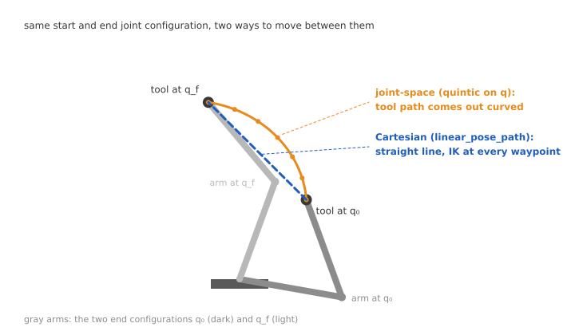
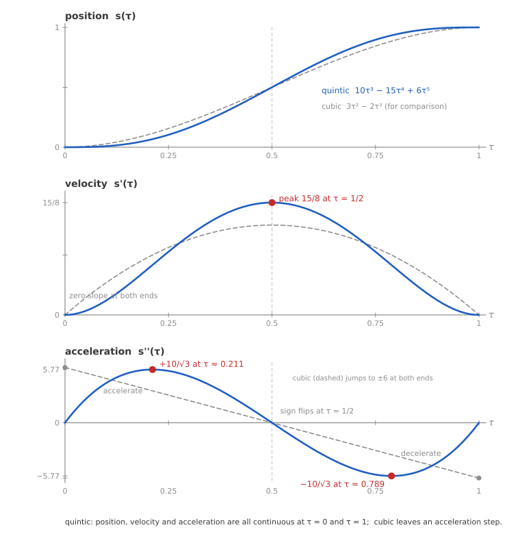
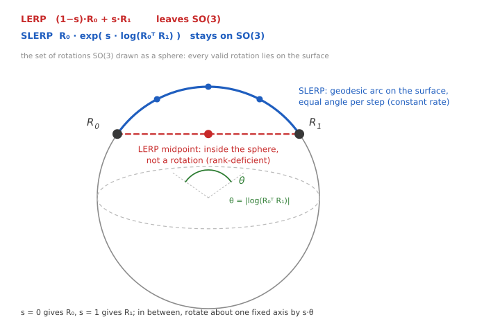
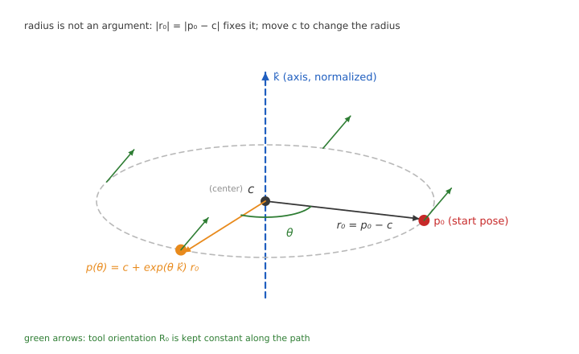
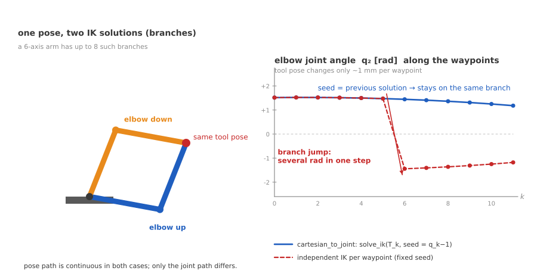

# robot_trajectory : 5차 다항식 궤적, SO(3) interpolation, seed IK<!-- omit from toc -->

IK가 pose 하나를 관절각으로 바꾼다면 ([robot_kinematics.md](robot_kinematics.md)), 이 패키지는 **점과 점 사이를 어떻게 이동할 것인가**를 다루며, 관절 공간과 Cartesian 공간 중 어디에서 interpolation하느냐에 따라 두 종류로 나뉨.

- [0. Interpolation 방법 종류](#0-interpolation-방법-종류)
- [1. 5차 다항식 궤적 (`joint_traj.py`)](#1-5차-다항식-궤적-joint_trajpy)
  - [1.1 Rest-to-rest interpolation 문제](#11-rest-to-rest-interpolation-문제)
  - [1.2 5차 다항식을 사용하는 이유](#12-5차-다항식을-사용하는-이유)
  - [1.3 시간 파라미터화](#13-시간-파라미터화)
  - [1.4 코드: quintic_joint_trajectory](#14-코드-quintic_joint_trajectory)
  - [1.5 설계 근거와 한계](#15-설계-근거와-한계)
  - [1.6 검증: 경계조건과 limit](#16-검증-경계조건과-limit)
- [2. SO(3) interpolation (`cartesian_traj.py`)](#2-so3-interpolation-cartesian_trajpy)
  - [2.1 회전행렬에 LERP를 쓸 수 없는 이유](#21-회전행렬에-lerp를-쓸-수-없는-이유)
  - [2.2 exp와 log](#22-exp와-log)
  - [2.3 SLERP 유도](#23-slerp-유도)
  - [2.4 코드: \_exp_so3와 slerp](#24-코드-_exp_so3와-slerp)
  - [2.5 검증: geodesic 성질](#25-검증-geodesic-성질)
- [3. Pose 경로](#3-pose-경로)
  - [3.1 직선: linear_pose_path](#31-직선-linear_pose_path)
  - [3.2 원호: circle_pose_path](#32-원호-circle_pose_path)
  - [3.3 검증: 경로 기하](#33-검증-경로-기하)
- [4. 경로에서 관절로](#4-경로에서-관절로)
  - [4.1 Waypoint마다 IK를 푸는 문제](#41-waypoint마다-ik를-푸는-문제)
  - [4.2 직전 해를 seed로 사용](#42-직전-해를-seed로-사용)
  - [4.3 코드: cartesian_to_joint](#43-코드-cartesian_to_joint)
  - [4.4 검증: 연속성과 실패 보고](#44-검증-연속성과-실패-보고)
- [참고 문헌](#참고-문헌)

---

## 0. Interpolation 방법 종류

목적에 따라 interpolation하는 공간이 달라짐.

|                     | 관절 공간 (`joint_traj.py`) | Cartesian 공간 (`cartesian_traj.py`) |
| ------------------- | --------------------------- | ------------------------------------ |
| interpolation 대상  | 관절각 $q$                  | pose $T$                             |
| tool0 경로          | 예측 불가 (보통 곡선)       | 직선과 원호로 **지정 가능**          |
| IK 필요             | 없음                        | waypoint마다 필요                    |
| 속도와 가속도 limit | 직접 제어                   | 간접적                               |
| 용도                | 자세 이동, home 복귀        | 용접, 도포, 조립                     |

데모 시퀀스는 둘을 섞어 쓰며, home 이동은 관절 공간, 직선과 원 구간은 Cartesian을 사용함.



같은 $q_0$에서 $q_f$로 가더라도 관절 공간에서 interpolation하면 tool0 경로가 곡선(주황)이 되고, Cartesian에서 interpolation하면 직선(파랑)이 됨.

```
joint_traj.py       q0 → qf 를 5차 다항식 프로파일로 interpolation
                    (limit 기반 최소 시간 산출)

cartesian_traj.py   T0 → T1 pose 경로 생성 (직선 / 원호)
                       │
                       ▼  waypoint마다 seed IK
                    연속 관절 경로
```

---

## 1. 5차 다항식 궤적 (`joint_traj.py`)

### 1.1 Rest-to-rest interpolation 문제

정지 상태의 $q_0$에서 출발해 정지 상태의 $q_f$에 도달하는 궤적을 만드는 문제이며, 요구 조건은 아래와 같이 6개임.

$$
q(0) = q_0,\quad q(T) = q_f,\quad \dot q(0) = \dot q(T) = 0,\quad \ddot q(0) = \ddot q(T) = 0
$$

- $T$ : 전체 소요 시간
- $\dot q$, $\ddot q$ : 관절 속도와 가속도

가속도까지 0으로 맞추는 이유는, 가속도가 양 끝에서 튀면 토크가 계단 형태로 변하고 그 불연속이 기계 진동과 오버슈트를 유발하기 때문임.

관절마다 따로 풀지 않고 **스칼라 프로파일 $s(\tau) \in [0,1]$ 하나**를 만든 뒤 모든 관절에 스케일링하는 방식을 사용함.

$$
q(t) = q_0 + s(\tau)\,(q_f - q_0), \qquad \tau = t/T
$$

- $s(\tau)$ : 0에서 1로 올라가는 스칼라 프로파일
- $\tau$ : 전체 시간 $T$로 나눈 무차원 시간으로, 0에서 1까지

이러면 모든 관절이 **동시에 출발해 동시에 도착**하고, 관절 공간 직선 경로가 보장됨.

### 1.2 5차 다항식을 사용하는 이유

경계조건이 6개이므로 미지수도 6개여야 하는데, 5차 다항식(quintic)의 계수가 정확히 6개임.

$$
s(\tau) = a_0 + a_1\tau + a_2\tau^2 + a_3\tau^3 + a_4\tau^4 + a_5\tau^5
$$

> 3차(cubic)는 계수가 4개라 위치와 속도 조건만 만족할 수 있고, 가속도가 양 끝에서 불연속이 되어 rest-to-rest 요구를 채우지 못함 ([1.1_Rest-to-rest interpolation 문제](#11-rest-to-rest-interpolation-문제)).

$\tau = 0$ 조건 3개가 앞쪽 계수를 바로 없앰.

$$
s(0)=0 \Rightarrow a_0 = 0, \qquad s'(0)=0 \Rightarrow a_1 = 0, \qquad s''(0)=0 \Rightarrow a_2 = 0
$$

남은 $\tau = 1$ 조건 3개를 $s(\tau) = a_3\tau^3 + a_4\tau^4 + a_5\tau^5$에 대입하면 아래와 같음.

$$
\begin{aligned}
a_3 + a_4 + a_5 &= 1 \\
3a_3 + 4a_4 + 5a_5 &= 0 \\
6a_3 + 12a_4 + 20a_5 &= 0
\end{aligned}
$$

- 첫째 식 : $s(1) = 1$(도착 시 $q = q_f$)로, $\tau = 1$을 넣으면 $\tau^3 = \tau^4 = \tau^5 = 1$이라 $s(1) = a_3 + a_4 + a_5$가 됨
- 둘째 식 : $s'(1) = 0$(도착 시 속도 0)으로, $s' = 3a_3\tau^2 + 4a_4\tau^3 + 5a_5\tau^4$에 $\tau = 1$을 넣은 것
- 셋째 식 : $s''(1) = 0$(도착 시 가속도 0)으로, $s'' = 6a_3\tau + 12a_4\tau^2 + 20a_5\tau^3$에 $\tau = 1$을 넣은 것

첫째 식에서 $a_3 = 1 - a_4 - a_5$를 얻어 둘째와 셋째 식에 대입하면 미지수가 둘로 줄어듦.

$$
\begin{aligned}
3(1 - a_4 - a_5) + 4a_4 + 5a_5 &= 0 \quad\Rightarrow\quad a_4 = -3 - 2a_5 \\
6(1 - a_4 - a_5) + 12a_4 + 20a_5 &= 0 \quad\Rightarrow\quad 6a_4 + 14a_5 = -6
\end{aligned}
$$

- 첫 줄의 $a_4 = -3 - 2a_5$를 둘째 줄에 넣으면 $-18 - 12a_5 + 14a_5 = -6$, 따라서 $a_5 = 6$
- 되짚어 올라가면 $a_4 = -3 - 12 = -15$, $a_3 = 1 + 15 - 6 = 10$

따라서 프로파일은 아래와 같음.

$$
\boxed{\ s(\tau) = 10\tau^3 - 15\tau^4 + 6\tau^5\ }
$$

속도와 가속도 프로파일도 필요하므로 미리 미분해 두며, 1.4절의 코드가 이 식을 그대로 사용함.

$$
s'(\tau) = 30\tau^2 - 60\tau^3 + 30\tau^4 = 30\,\tau^2(1-\tau)^2
$$

$$
s''(\tau) = 60\tau - 180\tau^2 + 120\tau^3 = 60\,\tau(1-\tau)(1-2\tau)
$$

인수분해된 형태에서 성질이 바로 읽힘.

- $s'(\tau) = 30\tau^2(1-\tau)^2 \ge 0$ : **항상 Monotone Increasing**하므로 오버슈트 없음
- $s'$이 양 끝에서 2차로 0에 접근 : 부드러운 출발과 정지
- $s''$의 부호가 $\tau = 1/2$에서 뒤집힘 : 가속 구간과 감속 구간의 경계

### 1.3 시간 파라미터화

$s(\tau)$만으로는 소요 시간 $T$가 정해지지 않으므로, **속도와 가속도 limit을 만족하는 최소 $T$를 역산**하는 것이 `min_duration()`의 역할임.

$\tau = t/T$ 이므로 시간 미분에 $1/T$가 곱해짐.

$$
\dot q = \frac{s'(\tau)}{T}\,\Delta q, \qquad \ddot q = \frac{s''(\tau)}{T^2}\,\Delta q
$$

- $\Delta q = q_f - q_0$ : 관절별 변위
- $s'$, $s''$ : $\tau$에 대한 1차, 2차 도함수

따라서 $s'$과 $s''$의 최댓값만 알면 됨.



그림에서 파란 실선이 5차 다항식, 회색 점선이 비교용 cubic임.  
빨간 점이 아래에서 구할 속도 peak($\tau = 1/2$)와 가속도 peak($\tau \approx 0.21,\ 0.79$)의 위치임.

**속도 peak** : $s'(\tau) = 30\tau^2(1-\tau)^2$은 $\tau = 1/2$에서 최대임.

$$
s'_{\max} = 30 \cdot \tfrac{1}{4} \cdot \tfrac{1}{4} = \frac{15}{8}
$$

**가속도 peak** : $s'''(\tau) = 60 - 360\tau + 360\tau^2 = 0$ 에서 $6\tau^2 - 6\tau + 1 = 0$, 즉 $\tau^\ast = \frac{3 - \sqrt{3}}{6} \approx 0.2113$임.

$1 - \tau^\ast = \frac{3+\sqrt 3}{6}$, $1 - 2\tau^\ast = \frac{1}{\sqrt 3}$ 을 대입하면 아래와 같음.

$$
s''_{\max} = 60 \cdot \frac{3-\sqrt3}{6}\cdot\frac{3+\sqrt3}{6}\cdot\frac{1}{\sqrt3}
= 60 \cdot \frac{6}{36} \cdot \frac{1}{\sqrt3} = \frac{10}{\sqrt{3}} \approx 5.774
$$

limit 조건 $|\dot q| \le v_{\max}$, $|\ddot q| \le a_{\max}$ 에 대입해 $T$에 대해 풀면

$$
T \ge \frac{15\,|\Delta q|}{8\,v_{\max}}, \qquad T \ge \sqrt{\frac{10\,|\Delta q|}{\sqrt{3}\,a_{\max}}}
$$

- $v_{\max}$, $a_{\max}$ : 관절 속도와 가속도 한계로, `min_duration()`의 인자

두 하한 중 큰 쪽, 그리고 **모든 관절 중 가장 느린 쪽**이 공통 duration이 됨.

```python
t_vel = 15.0 * dq / (8.0 * v_max)
t_acc = np.sqrt(10.0 * dq / (math.sqrt(3.0) * a_max))
return float(max(t_vel.max(), t_acc.max()))
```

속도 하한은 $|\Delta q|$에 **비례**하고 가속도 하한은 $\sqrt{|\Delta q|}$에 비례하므로, 짧은 이동은 가속도가, 긴 이동은 속도가 병목이 됨.

### 1.4 코드: quintic_joint_trajectory

```python
# 1. Duration from limits unless given explicitly (>= dt for sampling)
T = duration if duration is not None else min_duration(q0, qf, v_max, a_max)
T = max(T, dt)

# 2. Uniform time grid including both endpoints
n = int(math.ceil(T / dt)) + 1
t = np.linspace(0.0, T, n)
tau = t / T

# 3. Quintic profile and its time derivatives
s = 10.0 * tau**3 - 15.0 * tau**4 + 6.0 * tau**5
sd = (30.0 * tau**2 - 60.0 * tau**3 + 30.0 * tau**4) / T
sdd = (60.0 * tau - 180.0 * tau**2 + 120.0 * tau**3) / T**2

# 4. Scale the scalar profile onto every joint
q = q0[None, :] + np.outer(s, dq)
qd = np.outer(sd, dq)
qdd = np.outer(sdd, dq)
```

- **3단계** : 속도와 가속도를 수치미분이 아니라 **해석적으로** 샘플링하므로, 정확도 손실이 없고 $1/T$, $1/T^2$ 스케일이 [1.3\_시간 파라미터화](#13-시간-파라미터화) 유도 그대로 반영됨
- **4단계** : `np.outer(s, dq)`가 $(N,) \times (\text{dof},) \to (N, \text{dof})$ 확장을 담당하며, 관절 루프 없이 한 번에 처리함
- **샘플 간격 주의** : `n = ceil(T/dt) + 1` 개의 점을 `linspace(0, T, n)`으로 균일 배치하므로 실제 간격은 $T/(n-1)$ 이며 **`dt` 이하**이므로, `dt`는 목표가 아니라 상한이며 양 끝점이 정확히 $0$과 $T$에 놓이는 것을 우선한 결과임
- **duration 인자** : 명시하면 limit 계산을 건너뛰고 그 값을 사용하며, 여러 세그먼트의 시간을 맞춰야 할 때 쓰지만 **limit 초과를 검사하지 않으므로** 한계 준수는 호출자가 책임짐

### 1.5 설계 근거와 한계

- **공통 duration** : 가장 느린 관절 기준으로 통일하므로 나머지 관절은 여유를 남긴 채 움직이므로, 시간 최적은 아니지만 모든 관절이 동시에 출발과 도착해 궤적이 예측 가능해짐
- **중간 정지 없는 rest-to-rest 전용** : 여러 waypoint를 부드럽게 이어 가려면 세그먼트마다 정지해야 하며, 통과 속도를 유지하는 blending은 미구현 상태임
- **tool0 경로** : 관절 공간 직선이 Cartesian 직선을 의미하지 않아 tool0 경로는 곡선이 되므로, 직선이 필요하면 `linear_pose_path`를 사용함 ([3.1\_직선: linear_pose_path](#31-직선-linear_pose_path))
- **관절 한계 미검사** : $q_0$, $q_f$가 관절 범위 안이라고 가정하지만, 5차 프로파일이 단조라 중간에 범위를 벗어나지는 않음 (`test_position_stays_within_bounds`)

### 1.6 검증: 경계조건과 limit

`test/test_joint_traj.py`가 아래 4가지를 확인함.

| 클래스                   | 확인 내용                                                                                              |
| ------------------------ | ------------------------------------------------------------------------------------------------------ |
| `TestBoundaryConditions` | 양 끝 위치 일치, 속도와 가속도 0, 균일 시간 간격, 변위 0 처리                                          |
| `TestLimits`             | $\max \lvert \dot q \rvert \le v_{\max}$, $\max \lvert \ddot q \rvert \le a_{\max}$, duration 우선순위 |
| `TestConsistency`        | `qd`와 `qdd`가 실제로 `q`의 미분인지, 단조성(오버슈트 없음)                                            |

`TestLimits`가 시간 파라미터화에서 세운 식을 검증하는 지점으로 ([1.3\_시간 파라미터화](#13-시간-파라미터화)), $15/8$이나 $10/\sqrt3$을 잘못 적었다면 여기서 limit 초과로 실패함.

**`TestConsistency`가 해석적 미분을 교차검증함.**

```python
traj = quintic_joint_trajectory(Q0, QF, dt=0.001)
qd_num = np.gradient(traj.q, traj.t, axis=0)
np.testing.assert_allclose(traj.qd[5:-5], qd_num[5:-5], atol=1e-3)
```

`np.gradient`의 수치미분과 대조함.  
양 끝 5샘플을 제외하는 이유는 경계에서 `np.gradient`가 단측 차분으로 바뀌어 정확도가 떨어지기 때문이며, 검증 대상 코드의 문제가 아님.

---

## 2. SO(3) interpolation (`cartesian_traj.py`)

### 2.1 회전행렬에 LERP를 쓸 수 없는 이유

위치는 LERP(linear interpolation)로 구함.

$$
p(s) = (1-s)\,p_0 + s\,p_1
$$

- $p_0$, $p_1$ : 시작과 끝 위치
- $s$ : 0에서 1까지의 interpolation 파라미터

$SO(3)$는 벡터공간이 아니라 곡면(다양체)이고 그 위 두 점의 가중평균은 곡면 밖으로 떨어지므로, 회전에 같은 방식을 적용하면 결과가 **회전행렬이 아님**.

극단적인 예로 $R_0 = I$, $R_1 = R_z(\pi)$의 중간값을 계산해 봄.

$$
\frac{1}{2}\left(
\begin{bmatrix} 1&0&0\\0&1&0\\0&0&1 \end{bmatrix}
+
\begin{bmatrix} -1&0&0\\0&-1&0\\0&0&1 \end{bmatrix}
\right) =
\begin{bmatrix} 0&0&0\\0&0&0\\0&0&1 \end{bmatrix}
$$

0이 아닌 열이 하나뿐이라 rank가 1이고 determinant도 0이므로, 회전행렬은커녕 invertible matrix도 아님.

필요한 것은 곡면 **위를 따라가는** interpolation, 즉 geodesic(측지선)임.



그림에서 빨간 현(LERP)의 중점은 구 안쪽으로 들어가 회전이 아니고, 파란 호(SLERP)는 구면 위를 같은 각도씩 나아가 항상 회전행렬임.

### 2.2 exp와 log

$SO(3)$의 접공간은 skew-symmetric 행렬 $\mathfrak{so}(3)$이고, 두 공간은 exp / log로 오감.

$$
\exp: \hat{w} \in \mathfrak{so}(3) \longrightarrow R \in SO(3), \qquad
\log: R \longrightarrow \hat{w}
$$

- $w$ : rotation vector(회전축 × 회전각)
- $\hat w$ : $w$의 skew-symmetric 행렬로, $\hat w\, v = w \times v$
- $\mathfrak{so}(3)$ : 그런 행렬의 집합이며 $SO(3)$의 접공간

**exp = Rodrigues 공식** : rotation vector $w$($= \theta\hat a$)를 회전행렬로 바꿈.

$$
\exp(\hat w) = I + \sin\theta\, K + (1-\cos\theta)\,K^2, \qquad K = \hat a^\wedge,\ \theta = \|w\|
$$

- $\theta = \|w\|$ : 회전각
- $\hat a = w/\theta$ : 단위 회전축
- $K = \hat a^\wedge$ : $\hat a$의 skew-symmetric 행렬

**log = Rodrigues 역연산** : 회전행렬을 rotation vector로 바꾸며, `ik.py`의 `rotation_vector()`가 이미 구현해 둠 ([_robot kinematics.md_ 4.2_Pose 오차의 6차원 벡터 표현](robot_kinematics.md#42-pose-오차의-6차원-벡터-표현))

두 함수가 있으면 "회전을 벡터처럼 다루다가 다시 회전으로 되돌리는" 조작이 가능해지는데, SLERP가 정확히 그 조작임.

### 2.3 SLERP 유도

$R_0$에서 $R_1$까지의 **상대 회전**을 먼저 구함.

$$
R_{\text{rel}} = R_0^\top R_1
$$

- $R_{\text{rel}}$ : $R_0$에 추가로 적용하면 $R_1$이 되는 회전($R_0\, R_{\text{rel}} = R_1$)

이것을 rotation vector로 펼치면 "축 하나 둘레로 몇 rad" 라는 형태가 됨.

$$
w = \log(R_{\text{rel}}) = \theta\,\hat a
$$

$s$만큼만 회전하려면 각도를 $s$배 하고 다시 회전으로 되돌린 뒤 $R_0$에 곱하면 완성됨.

$$
\boxed{\ R(s) = R_0 \exp\big(s \log(R_0^\top R_1)\big)\ }
$$

- $s$ : 0에서 1까지의 interpolation 파라미터로, $R(0) = R_0$, $R(1) = R_1$

성질을 확인함.

- $s=0$ : $R_0 \exp(0) = R_0$
- $s=1$ : $R_0 R_0^\top R_1 = R_1$
- 중간 : **고정된 축 $\hat a$ 둘레를 일정한 각속도로** 회전하며, 두 자세를 잇는 최단 경로(geodesic)임

$\exp$의 출력이 회전행렬이고 회전행렬끼리의 곱도 회전행렬이므로, 결과가 항상 $SO(3)$ 안에 머무는 것도 자명함.

> `rotation_vector()`가 $\theta \in [0, \pi]$를 반환하므로 SLERP는 **항상 짧은 쪽**으로 돌며, 긴 쪽으로 돌리는 옵션은 없음.

### 2.4 코드: \_exp_so3와 slerp

```python
def _exp_so3(w):
    """Rodrigues formula: rotation matrix of rotation vector w."""
    angle = np.linalg.norm(w)
    K = np.array([[0.0, -w[2], w[1]], [w[2], 0.0, -w[0]], [-w[1], w[0], 0.0]])
    if angle < 1e-12:
        return np.eye(3) + K
    K /= angle
    return np.eye(3) + math.sin(angle) * K + (1.0 - math.cos(angle)) * (K @ K)


def slerp(R0, R1, s):
    # Relative rotation as a vector, scaled and re-applied
    w = rotation_vector(R0.T @ R1)
    return R0 @ _exp_so3(s * w)
```

`slerp` 본문은 유도한 식을 그대로 옮긴 2줄임.

`_exp_so3`에서 눈여겨볼 곳은 미소각 분기로, `K`를 `angle`로 나누기 **전에** 검사하기 때문에 0으로 나누는 상황이 없음.  
$\|w\| \to 0$ 에서 $\exp(\hat w) \approx I + \hat w$ 이므로 정규화하지 않은 `K`를 그대로 더하는 것이 올바른 1차 근사임.

`ik.py`의 `rotation_vector()`를 재사용하므로, log 구현이 프로젝트에 하나만 존재해 IK와 궤적이 같은 자세 표현을 공유함.

### 2.5 검증: geodesic 성질

`test/test_cartesian_traj.py`의 `TestSlerp`가 3가지를 확인함.

| 테스트                           | 확인 내용                                             |
| -------------------------------- | ----------------------------------------------------- |
| `test_endpoints`                 | $s=0 \to R_0$, $s=1 \to R_1$                          |
| `test_halfway_is_half_angle`     | $R_z(0) \to R_z(90°)$ 의 $s=0.5$ 가 정확히 $R_z(45°)$ |
| `test_result_is_rotation_matrix` | 전 구간에서 $RR^\top = I$, $\det R = 1$               |

`test_halfway_is_half_angle`이 "일정 각속도"를 검증하는 지점으로, 각도가 절반이 아니라면 interpolation 결과가 geodesic 위에 있지 않다는 뜻임.

`test_result_is_rotation_matrix`는 회전행렬에 LERP를 적용했을 때 생기는 오류를 확인하는 테스트로 ([2.1\_회전행렬에 LERP를 쓸 수 없는 이유](#21-회전행렬에-lerp를-쓸-수-없는-이유)), LERP로 잘못 구현했다면 이 테스트가 즉시 실패를 탐지함.

---

## 3. Pose 경로

### 3.1 직선: linear_pose_path

위치는 LERP, 자세는 SLERP로 interpolation하며, 두 interpolation을 같은 파라미터 $s$로 묶은 것이 전부임.

```python
for k in range(n):
    s = k / (n - 1)
    T = np.eye(4)
    T[:3, :3] = slerp(T0[:3, :3], T1[:3, :3], s)
    T[:3, 3] = (1.0 - s) * p0 + s * p1
    poses.append(T)
```

$s$를 공유하므로 위치와 자세가 **동시에 시작하고 동시에 끝나므로**, 위치는 먼저 도착했는데 자세는 아직 돌고 있는 상황이 생기지 않음.

`n`은 양 끝점을 **포함한** 개수이므로, `n=2`면 시작과 끝만 담고 `n=11`이면 중간에 9개가 들어감.

### 3.2 원호: circle_pose_path

중심에서 시작점으로 향하는 반지름 벡터를 축 둘레로 돌리는 방식임.

$$
p(\theta) = c + \exp(\theta\,\hat k)\, r_0, \qquad r_0 = p_0 - c
$$

- $c$ : 원의 중심
- $\hat k$ : 회전축 단위 벡터
- $r_0 = p_0 - c$ : 시작점의 반지름 벡터
- $\theta$ : 시작점에서 돌린 각



그림처럼 중심 $c$에서 시작점으로 향하는 $r_0$를 축 $\hat k$ 둘레로 $\theta$만큼 돌려 위치를 만들고, 자세(초록 화살표)는 전 구간 같게 유지함.

```python
axis = axis / np.linalg.norm(axis)
r0 = T0[:3, 3] - center

for k in range(n):
    theta = angle * k / (n - 1)
    T[:3, :3] = T0[:3, :3]          # 자세 고정
    T[:3, 3] = center + _exp_so3(theta * axis) @ r0
```

회전행렬은 길이를 보존하므로 $\|p(\theta) - c\| = \|r_0\|$ 가 자동으로 유지되므로, 반지름을 따로 계산하거나 강제할 필요가 없음.

**반지름이 인자에 없는 점**에 주의해야 하는데, 시작 pose와 center의 거리가 곧 반지름이므로 반지름을 바꾸려면 center를 옮겨야 함.

- **자세** : $R(\theta) = R_0$ 로 전 구간 고정되며, 원을 그리며 tool을 항상 중심으로 향하게 하는 식의 동작은 미구현 상태임
- **축** : 자동으로 정규화되므로 크기에 상관없이 방향만 주면 됨

### 3.3 검증: 경로 기하

`TestLinearPath`, `TestCirclePath`가 기하 조건을 직접 확인함.

| 테스트                            | 확인 내용                                     |
| --------------------------------- | --------------------------------------------- |
| `test_endpoints_and_collinearity` | 중간 waypoint가 시작-끝 선분 위에 정확히 위치 |
| `test_points_stay_on_circle`      | 모든 waypoint의 반지름이 동일                 |
| `test_full_turn_returns_to_start` | $2\pi$ 회전 후 시작점 복귀                    |
| `test_orientation_is_constant`    | 원호 전 구간 자세 불변                        |

누적 오차가 있으면 한 바퀴를 돈 뒤 시작점에서 벗어나므로, `test_full_turn_returns_to_start`는 $\exp$ 구현의 정확도를 간접적으로 확인함.

> **`n=1`은 사용 불가** : 두 함수 모두 `k / (n - 1)`로 파라미터를 만들므로 `ZeroDivisionError`가 나며, `n >= 2`를 전제로 함.

---

## 4. 경로에서 관절로

### 4.1 Waypoint마다 IK를 푸는 문제

pose 경로가 있어도 로봇에 보낼 수 있는 것은 관절각이므로, waypoint마다 IK를 풀어야 함.

문제는 IK의 해가 여러 개라는 것임 ([_robot kinematics.md_ 4.1_Pose에서 관절각으로](robot_kinematics.md#41-pose에서-관절각으로)).  
waypoint마다 독립적으로 풀면 인접한 두 waypoint가 **서로 다른 해 분기**로 갈 수 있음.

```
waypoint k    → elbow up 해
waypoint k+1  → elbow down 해   ← pose는 1 mm 차이인데 관절은 수 rad 점프
```

pose 상으로는 연속인데 관절 공간에서 튀는 상황으로, 실로봇이라면 급격한 자세 전환이고 시뮬레이션이라도 화면에서 자세가 순간적으로 건너뜀.

### 4.2 직전 해를 seed로 사용

DLS IK가 **seed에서 가장 가까운 해 분기로 수렴한다**는 성질 ([_robot kinematics.md_ 4.6_IK 사용 시 주의점](robot_kinematics.md#46-ik-사용-시-주의점))을 그대로 이용함.

$$
q_k = \text{solve\_ik}(T_k,\ \text{seed} = q_{k-1})
$$

- $T_k$ : $k$번째 waypoint의 pose
- $q_k$ : 그 waypoint의 IK 해로, 다음 waypoint의 seed가 됨

waypoint 간격이 촘촘하면 $T_k$와 $T_{k-1}$이 가깝고, 따라서 $q_{k-1}$은 이미 해 근처이므로, DLS가 몇 번 반복만에 **같은 분기 안에서** 수렴하고, 분기를 바꿀 이유가 없으므로 관절 경로가 연속으로 유지됨.



왼쪽은 같은 tool pose를 만드는 두 해(elbow up과 down)임.  
오른쪽은 waypoint를 따라 독립 IK가 분기를 바꿔 관절각이 튀는 경우(빨강)와 seed 전달로 같은 분기를 유지하는 경우(파랑)임.

부수 효과로 수렴도 빨라짐.  
cold start 대비 반복 횟수가 크게 줄고, 성공률도 높음 (`test_converges_from_perturbed_seed`가 30/30, `test_converges_from_home_seed`가 8/10인 차이).

### 4.3 코드: cartesian_to_joint

```python
q = np.asarray(q_seed, dtype=float).copy()
out = np.zeros((len(poses), len(q)))

for i, T in enumerate(poses):
    result = solve_ik(T, q, **ik_kwargs)
    out[i] = result.q
    if not result.success:
        return CartesianJointPath(False, out, i)
    q = result.q
return CartesianJointPath(True, out, -1)
```

`q = result.q` 한 줄이 seed 전달의 전부임.

- **실패 시 즉시 중단** : 이후 waypoint는 더 멀어질 가능성이 높고, 실패한 해를 seed로 계속 쓰면 오차가 이후 waypoint까지 전파됨
- **실패해도 부분 결과를 반환** : `out`의 `failed_index` 이전 행은 유효한 해임

```python
@dataclass
class CartesianJointPath:
    success: bool
    q: np.ndarray        # (N, dof) joint path (valid rows up to failure)
    failed_index: int    # -1 if fully solved
```

`solve_ik`가 예외 대신 `IKResult`를 반환하도록 설계되어 있어 가능한 구조임 ([_robot kinematics.md_ 4.5\_코드: solve_ik](robot_kinematics.md#45-코드-solve_ik)).  
호출자는 "몇 번째 waypoint에서 막혔는지"를 알고 경로를 수정하거나 세그먼트를 나눌 수 있음.

**`**ik_kwargs`전달.**`damping`, `max_iters`등을 그대로 넘기므로, 촘촘한 경로라면`max_iters`를 줄여 속도를 얻는 식의 조정이 가능함.

### 4.4 검증: 연속성과 실패 보고

`TestCartesianToJoint`가 3가지를 확인함.

- **pose 재현** (`test_tracks_linear_path`) : 반환된 각 $q$를 FK로 되돌려 목표 waypoint와 대조하며, 위치와 자세 모두 $10^{-3}$ 이내임
- **관절 연속성** (`test_joint_continuity`) : 이 패키지의 핵심 주장을 직접 검증함

```python
poses = linear_pose_path(T0, T1, 41)
result = cartesian_to_joint(poses, Q_A)
assert np.max(np.abs(np.diff(result.q, axis=0))) < 0.2
```

인접 waypoint 간 관절 변화가 0.2 rad 미만이어야 하며, 해 분기가 튀면 수 rad 차이가 나므로 즉시 실패함.

다만 이 케이스는 $T_0 \to T_1$ 이동 폭이 작아 분기 전환이 잘 일어나지 않는 조건임.  
**남은 과제** : 분기 점프를 적극적으로 유발하는 케이스는 아직 없으며, 특이점을 통과하는 긴 경로를 추가하면 seed 전달의 효과를 더 강하게 검증할 수 있음.

**실패 보고** (`test_unreachable_waypoint_reports_failure`) : 도중에 실패해도 호출자가 쓸 수 있는 상태로 반환되는지 보는 테스트로, 3 m 밖까지 이어지는 경로를 주고 `success=False`, `0 <= failed_index < 10`, 전 배열 유한을 확인함.

---

## 참고 문헌

- Siciliano, B. et al. [_Robotics: Modelling, Planning and Control_](https://doi.org/10.1007/978-1-84628-642-1). Springer. : 다항식 궤적, 시간 파라미터화
- Lynch, K. M., Park, F. C. [_Modern Robotics_](https://modernrobotics.org). Cambridge University Press. : $SO(3)$ exp/log, geodesic interpolation
- Shoemake, K. (1985). _Animating Rotation with Quaternion Curves_. SIGGRAPH. : SLERP 원논문
- Biagiotti, L., Melchiorri, C. [_Trajectory Planning for Automatic Machines and Robots_](https://doi.org/10.1007/978-3-540-85629-0). Springer. : rest-to-rest 프로파일 비교
